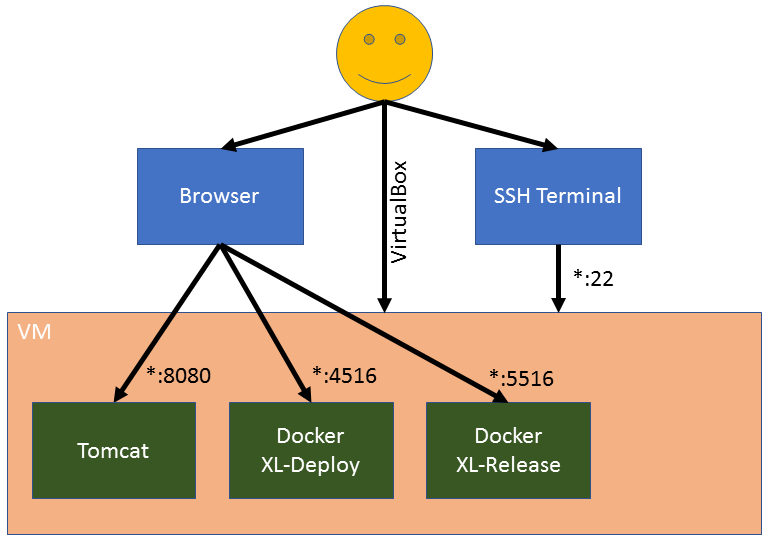
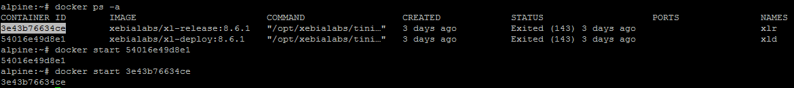
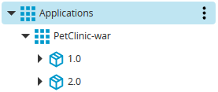
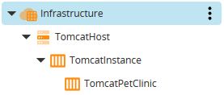
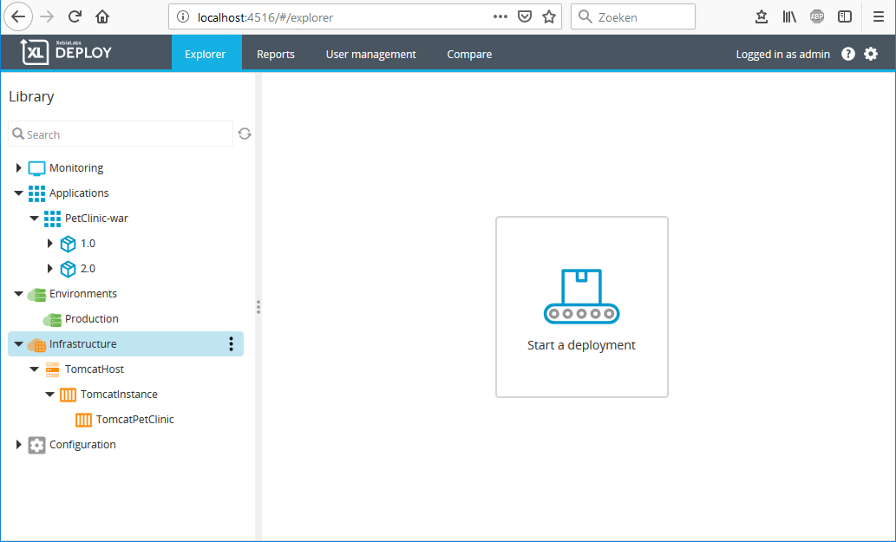
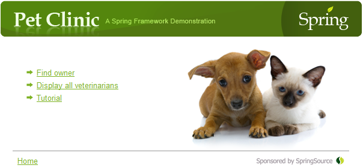

*Missing project description in github*

# Devoteam XL-Deploy/XL-Release KISS

This session will go through the basics of XL-Deploy and XL-Release. We'll use a Tomcat server to deploy the application. XL-Deploy, XL-Release and Tomcat are installed on a Alpine Linux VM using VirtualBox. 

*Missing the explaination why we want to use tools like xl-release/deploy. Also calrify what we are deploying, or if the artifacts don't matter why.*

## 1. Pre-requisites

* [Oracle VM VirtualBox](https://www.virtualbox.org/wiki/Downloads)
* Internet Browser, like Chrome, Firefox or Edge
* optional you can use a ssh terminal like [putty](https://www.putty.org/). Because you won't like the scaling of the virtualbox window :)

That's it! :) You can use a SSH Terminal like Putty to login to the VM, if you prefer it over using VirtualBox itself.

## 2. Architecture

Alpine hosts all applications used in this session. Tomcat is installed on the VM, while XL-Deploy and XL-Release are available as docker containers(with data persistence on the VM). The VM is available as an appliance you can import in your VirtualBox. The appliance also takes care of the port mapping, so you can access the applications using **"localhost:\<portNumber\>"**

## 3. Getting Started

### Import VM as Appliance
Follow [these](https://www.maketecheasier.com/import-export-ova-files-in-virtualbox/) instructions to import the VM as an appliance(*.ova).

*give a summary of the settings used eg. amount of memory. Just a short of the entire article. Or just set defaults* 

### Credentials
* VM 
    * User: `root`
    * Password: `devoteam2019`
* XL-Deploy/XL-Release:
    * User: `admin`
    * Password: `devoteam2019`

### URLs
* Tomcat: http://localhost:8080
* XL-Deploy: http://localhost:4516
* XL-Release: http://localhost:5516
* SSH VM: `localhost:22`
* Docker Ip\*: `172.17.0.1`

\*The "Docker Ip" is used to connect the containers and Tomcat over the network.

## 4. Start VM and its applications
1. Start the VM with VirtualBox
1. Login to the VM using VirtualBox or a SSH Terminal (Check the **[Credentials](#credentials)** paragraph above for username and password)
1. Execute the following command to get the `CONTAINER ID`s to start `XL-Deploy` and `XL-Release` in the next step:  
`docker ps -a`  

1. Start both containers using the following command:  
`docker start <containerId>`
1. The applications should become available in a minute or two.

## 5. Let's do it!
Before we start, it's important to know that each entry in XL-Deploy is known as a `Configuration Item` or `CI`. So each defined application, application version, environment, host, etc is a `CI`.

*Totally blue, and you smack me in the head with every entry in xl-deploy is a CI. What is an entry when do I use it.*

#### XL-Deploy: First Deployment
*What am I doing?, where. Started to execute without the awareness that the detailed steps where below*

We going to the following:
1. Import the `PetClinic` application to deploy
1. Define the `Tomcat` infrastructure
1. Define an environment we can deploy to
1. First Deployment of `PetClinic`
1. Rollback a version of `PetClinic`

##### Import PetClinic
Import the `PetClinic` application, so you can deploy it later.
1. Login to [XL-Deploy](http://localhost:4516)
1. Click on the `...` next to `Applications`, then go to `Import` > `From XL Deploy Server`
1. Select `PetClinic-war/1.0` and click `Import`, you can find it in the packages selection box.
1. Repeat steps 2 and 3 for package `PetClinic-war/2.0`
1. You should be able to see this:  

*What did I just do and why?*

##### Infrastructure
We need to define the `Tomcat` infrastructure, so XL-Deploy knows where to deploy the `PetClinic` application.  
We'll start by defining the target host first:  
1. Click on the `...` next to `Infrastructure`, then go to `New` > `overthere` > `SshHost`
1. Fill in the following:
    * Name: `TomcatHost`
    * Operating system: `Unix`
    * Connection Type: `SCP`
    * Address: `172.17.0.1`
    * Port: `22`
    * Username: `root`
    * Password: `devoteam2019`
1. Click on `Save and close`
1. Click on the `...` next to `TomcatHost`, then go to `Check connection`
1. Click on `Execute` to verify the connection to the `Tomcat` host. If verification is successful, click on `Finish`

Now we're going to define the Tomcat instance, so XL-Deploy knows where the `Tomcat` is installed on the target host.
1. Click on the `...` next to `TomcatHost`, then go to `New` > `tomcat` > `Server`
1. Fill in the following:
    * Name: `TomcatInstance`
    * Home: `/usr/local/tomcat/apache-tomcat-9.0.17`
    * Start Command: `/usr/local/tomcat/apache-tomcat-9.0.17/bin/startup.sh`
    * Stop Command: `/usr/local/tomcat/apache-tomcat-9.0.17/bin/shutdown.sh`
1. Click on `Save and close`

Last step in the infrastructure is to define where `PetClinic` needs to be deployed.
1. Click on the `...` next to `TomcatInstance`, then go to `New` > `tomcat` > `VirtualHost`
1. Fill in the following:
    * Name: `TomcatPetClinic`
1. Click on `Save and close`

The end result should look like this:  

#### Environment
An environment is nothing more than a grouping of one or more Infrastructure `CI`s you can deploy to. Your environment will only contain the `TomcatInstance` `CI`.

1. Click on the `...` next to `Environments`, then go to `New` > `Environment`
1. Fill in the following:
    * Name: `Production` (because that's how we roll)
    * Containers: `Infrastructure/TomcatHost/TomcatInstance/TomcatPetClinic`
1. Click on `Save and close`

#### First Deployment
Finally we can deploy. 

1. First check if you get a `HTTP 404` error when opening [PetClinic](http://localhost:8080/petclinic/) in your browser
1. In `XL-Deploy` click on the big `Start a deployment` button in the center:  

1. Drag and drop the following:
    * `Applications/PetClinic-war/1.0` to `Drag and drop package here`
    * `Environments/Production` to `Drag and drop environment here`
1. Click on `Preview` to see what tasks XL-Deploy will execute to deploy `PetClinic`
1. Click on `Close preview` to return to the previous view
1. Click on `Deploy` and `PetClinic` should be deployed in seconds
1. Go to [PetClinic](http://localhost:8080/petclinic/) and browse the application:  

1. Go back to `XL-Deploy` and click on `Finish`. This will tell XL-Deploy you accept this deployment. 

#### Rollback
What if you just deployed a version of `PetClinic` in production, but you don't want to accept that version and instead revert to the previous version? Here we going to do just that.

1. In `XL-Deploy` click on the big `Start a deployment` button in the center:  

1. Drag and drop the following:
    * `Applications/PetClinic-war/2.0` to `Drag and drop package here`
    * `Environments/Production` to `Drag and drop environment here`
1. Click on `Preview` and you can see that a task called `Destroy petclinic on TomcatPetClinic` has been added
1. Click on `Close preview` to return to the previous view
1. Click on `Deploy` and `PetClinic` should be deployed in seconds. 
1. Go to [PetClinic](http://localhost:8080/petclinic/). You see that the image on the homepage has been changed (if not: refresh the page):  

1. Let's say we won't accept this change in `PetClinic` and we want a rollback. Go back to `XL-Deploy` and click on `Rollback`, then `Yes`. 
1. Go back to [PetClinic](http://localhost:8080/petclinic/) and refresh the page. The image should revert to this:  

1. Go back to `XL-Deploy` and click on `Finish` to accept the deployment. Should you want to rollback after accepting a deployment, you can always start a new one.

#### XL-Release: First Release

#### XL-Deploy: Reporting

#### XL-Deploy: Tagging

